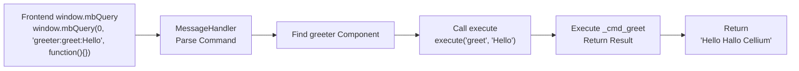
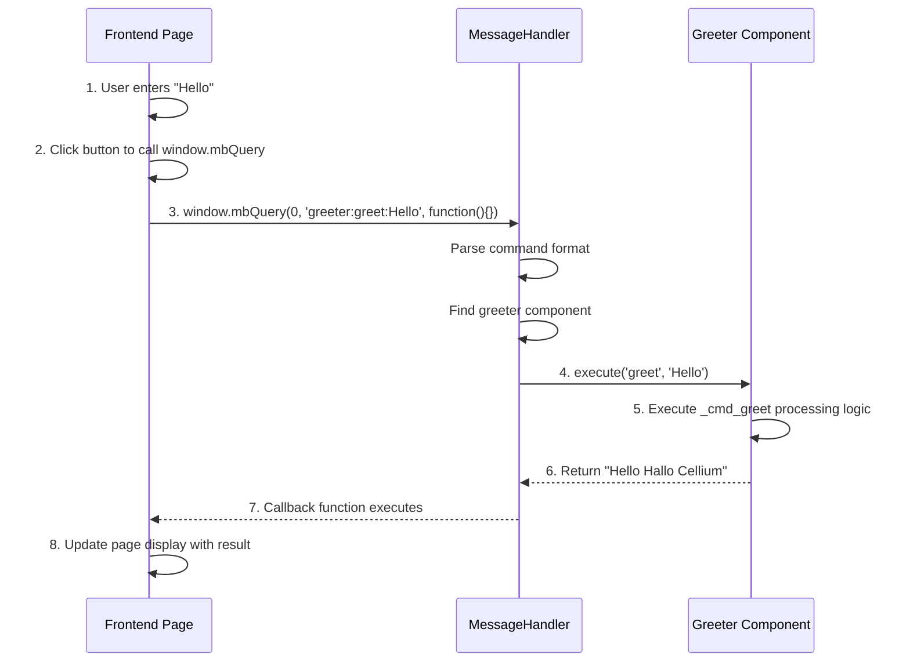

# Cellium Component Development Tutorial

[中文](index.md)|[English](index.en.md)

## Tutorials

- [Component Tutorial](component-tutorial.en.md) | [组件开发教程](component-tutorial.md)
- [Multiprocessing Tutorial](multiprocessing-tutorial.en.md) | [多进程教程](multiprocessing-tutorial.md)
- [Event Mode Tutorial](event-mode-tutorial.en.md) | [事件模式教程](event-mode-tutorial.md)
- [Logging Tutorial](logging-tutorial.en.md) | [日志使用](logging-tutorial.md)

> **"In Cellium, writing a feature module is as natural as writing a simple Python function, and the complex communication is handled by the microkernel."**

This tutorial demonstrates how to create a Cellium component from scratch using a complete example. We will build a "Greeter Component" that receives text input from the frontend, appends "Hallo Cellium" suffix, and returns the result for display.

## Communication Modes

Cellium supports two communication modes, choose based on your scenario:

### 1. Command Mode

Frontend calls backend component methods, suitable for **request-response** scenarios.

```python
# Backend component
from app.core.interface.base_cell import BaseCell

class Greeter(BaseCell):
    def _cmd_greet(self, text: str = "") -> str:
        return f"{text} Hallo Cellium"

# Frontend call
window.mbQuery(0, 'greeter:greet:Hello', function(){})
```

**Features**:
- One-to-one communication, direct component method call
- Supports return values (synchronous response)
- Ideal for simple request-response interactions

### 2. Event Mode

Publish-subscribe based event bus, suitable for **decoupled notification** scenarios.

```python
# Backend component subscribes to events
from app.core.bus import event

class Logger:
    @event("user.login")
    def on_login(self, event_name, **kwargs):
        print(f"User logged in: {kwargs.get('username')}")

# Frontend publishes event
window.mbQuery(0, 'bus:publish:user.login:{"username":"Alice"}', function(){})
```

**Features**:
- One-to-many communication, multiple components can subscribe to same event
- No return value (asynchronous notification)
- Ideal for cross-component decoupled communication

### Mode Comparison

| Feature | Command Mode | Event Mode |
|---------|-------------|------------|
| Communication | Frontend → Backend Component | Frontend → EventBus → Multiple Subscribers |
| Return Value | Yes (sync response) | No (async notification) |
| Use Case | Request-Response | Decoupled Notification |

> 💡 **This tutorial** focuses on **Command Mode** as it's more intuitive for beginners. For detailed Event Mode usage, see [README.md](file:///c:/Users/Administrator/Desktop/app/python-miniblink/README.md#事件总线-eventbus).

## 1. Cellium Communication Protocol

Before coding, let's understand Cellium's core communication protocol. All cross-layer communication follows the "Cell Addressing Protocol":

```
window.mbQuery(0, 'cell:command:args', function(){})
```

| Component | Description | Example |
|-----------|-------------|---------|
| **0** | Callback ID (fixed to 0, internal use) | `0` |
| **Cell** | Target cell name (component identifier) | `greeter` |
| **Command** | Action to be executed by the cell | `greet` |
| **Args** | Arguments passed to the action (**passed as a single string**) | `Hello` |

**Protocol Examples:**
```
# Send greet command to greeter component with argument "Hello"
window.mbQuery(0, 'greeter:greet:Hello', function(){})

# Send calc command to calculator component with expression "1+1"
window.mbQuery(0, 'calculator:calc:1+1', function(){})

# Pass arguments containing colons (e.g., file paths)
window.mbQuery(0, 'filemanager:read:C:/test.txt', function(){})
```

> 💡 **Args Note**: The argument portion is passed as a single string. If you need to pass multiple arguments, parse them within the component (e.g., using `args.split(':')`).

This concise protocol design makes frontend-backend communication intuitive and powerful.

## Mixed Mode: Command as String, Data as JSON

Args is a pure string, so you can choose flexible parameter passing methods:

**1. Simple Parameters (Direct String):**
```javascript
// Single simple value
window.mbQuery(0, 'greeter:greet:Hello', callback)

// Multiple simple parameters (parsed by component)
window.mbQuery(0, 'file:read:C:/test.txt:utf-8', callback)
```

**2. Complex Data (JSON String):**
```javascript
// Complex structures using JSON serialization
let userData = JSON.stringify({name: "Alice", age: 25, tags: ["admin", "pro"]});
window.mbQuery(0, `user:update:${userData}`, callback)
```

**3. Backend Automatic Parsing:**

The core layer automatically identifies JSON parameters, no manual judgment needed:

```python
# Component receives dict/list directly, no manual json.loads needed
def _cmd_update(self, data: dict):
    # data is already a dict type
    print(f"Received data: {data}")
    print(f"User name: {data.get('name')}")
    return f"Hello, {data.get('name')}"
```

| Scenario | Passing Method | Component Receives |
|----------|---------------|-------------------|
| Simple value | Direct string | `str` type |
| Complex structure | JSON serialization | `dict` or `list` type |
| Array | JSON serialization | `list` type |

> 💡 **Auto-Parse Rule**: The core layer `MessageHandler` automatically detects if Args starts with `{` or `[`, and if so, attempts to parse as JSON. The component's `execute` method receives the parsed object (dict/list), not the raw string.
>
> **Parsing Logic:**
> - Starts with `{` → Attempts to parse as `dict`
> - Starts with `[` → Attempts to parse as `list`
> - Other cases → Keeps as raw string
>
> **Note**: If JSON parsing fails, it falls back to the raw string without throwing an exception.

### Auto JSON Parse Example

**Frontend passing complex data:**
```javascript
// Pass user info object
let userInfo = JSON.stringify({
    name: "Alice",
    age: 25,
    skills: ["Python", "Qt", "Cellium"]
});
window.mbQuery(0, `user:create:${userInfo}`, function(customMsg, response) {
    console.log("Create result:", response);
});
```

**Backend component usage:**
```python
from app.core.interface.base_cell import BaseCell

class UserCell(BaseCell):
    def _cmd_create(self, user_data: dict):
        # user_data is directly a dict, no json.loads needed
        name = user_data.get('name')
        age = user_data.get('age')
        skills = user_data.get('skills', [])
        
        # Processing logic...
        return f"User {name} created successfully, age {age}"

## 2. Create Component File

Create a new file `greeter.py` in the `app/components/` directory:

```python
# app/components/greeter.py
# -*- coding: utf-8 -*-
"""
Greeter Component Example

Demonstrates basic Cellium framework usage:
1. Frontend sends text to backend
2. Backend processes and appends suffix
3. Frontend updates display with result
"""

from app.core.interface.base_cell import BaseCell


class Greeter(BaseCell):
    """Greeter component: receives text, appends suffix, and returns"""

    def _cmd_greet(self, text: str = "") -> str:
        """Add greeting suffix, e.g., greeter:greet:Hello"""
        if not text:
            return "Hallo Cellium"
        return f"{text} Hallo Cellium"
```

## 3. Component Structure Analysis

Cellium recommends using `BaseCell` as the component base class, which already implements the core `ICell` interface logic:

### Command Method Naming Rules

All command methods callable by the frontend must start with `_cmd_`:

```python
def _cmd_greet(self, text: str = "") -> str:
    """Add greeting suffix, e.g., greeter:greet:Hello"""
    return f"{text} Hallo Cellium"
```

**Naming Rules:**
- Method name format: `_cmd_<command_name>`
- Frontend call format: `component_name:command_name:arguments`
- Example: `_cmd_greet` → Frontend calls `greeter:greet:Hello`

**Docstring Purpose:**
- The method's docstring is automatically used as the command description in `get_commands()`
- Recommended format: `"Command description, e.g., component_name:command_name:example_args"`

### BaseCell Auto-Handles

- `execute`: automatically maps commands to `_cmd_` prefixed methods
- `get_commands`: automatically scans `_cmd_` method docstrings
- `cell_name`: defaults to lowercase class name (e.g., `Greeter` → `greeter`)
- Event registration: automatically calls `register_component_handlers()`

| Feature | Description |
|---------|-------------|
| Command Mapping | `greet` → `_cmd_greet()` |
| Command List | Auto-extracted from docstring |
| Component Name | Default `greeter` (lowercase class name) |

Execution Flow:



> 💡 **Cell Lifecycle Note**: Since Greeter inherits from `BaseCell`, it automatically has framework-injected `self.mp_manager`, `self.logger`, and `self.event_bus`. You can use them directly in command methods:
> ```python
> def _cmd_greet(self, text: str = "") -> str:
>     self.logger.info(f"Received greeting request: {text}")
>     return f"{text} Hallo Cellium"
> ```

## 3. Register Component

Edit `config/settings.yaml` and add the new component:

```yaml
# config/settings.yaml
enabled_components:
  - app.components.calculator.Calculator
  - app.components.greeter.Greeter    # Add this line
```

After restarting the application, the component will be loaded automatically. The startup log will show:

```
[INFO] Loaded component: Greeter (cell_name: greeter)
```

## 4. Frontend Integration

Add input fields and buttons in HTML to call the new component:

```html
<!-- index.html -->
<!DOCTYPE html>
<html>
<head>
    <meta charset="UTF-8">
    <title>Cellium Component Demo</title>
    <style>
        body {
            font-family: Arial, sans-serif;
            padding: 20px;
        }
        .container {
            max-width: 600px;
            margin: 0 auto;
        }
        .input-group {
            margin: 15px 0;
        }
        input[type="text"] {
            padding: 10px;
            width: 300px;
            font-size: 16px;
        }
        button {
            padding: 10px 20px;
            font-size: 16px;
            cursor: pointer;
            background-color: #4CAF50;
            color: white;
            border: none;
            border-radius: 4px;
        }
        button:hover {
            background-color: #45a049;
        }
        #result {
            margin-top: 20px;
            padding: 15px;
            background-color: #f5f5f5;
            border-radius: 4px;
            font-size: 18px;
            min-height: 24px;
        }
    </style>
</head>
<body>
    <div class="container">
        <h1>Greeter Component Demo</h1>
        
        <div class="input-group">
            <input type="text" id="input-text" placeholder="Enter your message...">
            <button onclick="sendToGreeter()">Send Greeting</button>
        </div>
        
        <div id="result">Result will appear here...</div>
    </div>

    <script>
        function sendToGreeter() {
            var input = document.getElementById('input-text');
            var resultDiv = document.getElementById('result');
            var text = input.value.trim();
            
            if (!text) {
                resultDiv.textContent = 'Please enter text!';
                return;
            }
            
            // Call Greeter component
            window.mbQuery(0, 'greeter:greet:' + text, function(customMsg, response) {
                document.getElementById('result').textContent = response;
            });
        }
    </script>
</body>
</html>
```

## 5. Complete Interaction Flow

Here's the complete interaction sequence diagram:



## 6. Runtime Effect

| Step | Frontend Operation | Backend Processing | Display Result |
|------|-------------------|-------------------|----------------|
| 1 | Enter "Hello" | Receive parameters | — |
| 2 | Click "Send Greeting" | Append suffix | — |
| 3 | — | Return "Hello Hallo Cellium" | — |
| 4 | Callback function executes | — | "Hello Hallo Cellium" |

## 7. Extended Features

Greeter component also supports reversing text functionality. Simply add new `_cmd_` methods to extend functionality without modifying the main `execute` logic (BaseCell handles command mapping automatically):

```python
from app.core.interface.base_cell import BaseCell

class Greeter(BaseCell):
    def get_commands(self) -> dict:
        return {
            "greet": "Add greeting suffix, e.g., greeter:greet:Hello",
            "reverse": "Reverse and add greeting suffix, e.g., greeter:reverse:Hello"
        }
    
    def _cmd_greet(self, text: str = "") -> str:
        """Add Hallo Cellium suffix"""
        if not text:
            return "Hallo Cellium"
        return f"{text} Hallo Cellium"
    
    def _cmd_reverse(self, text: str = "") -> str:
        """Reverse text and add greeting suffix"""
        if not text:
            return "Hallo Cellium"
        reversed_text = text[::-1]
        return f"{reversed_text} Hallo Cellium"
```

Frontend call:

```javascript
// Reverse greeting
window.mbQuery(0, 'greeter:reverse:Cellium', function(customMsg, response) {
    console.log(response);
})
// Result: "malloC Hallo Cellium"
```

## 8. Debugging Tips

During development, you can view component call logs:

```python
import logging
logger = logging.getLogger(__name__)

from app.core.interface.base_cell import BaseCell

class Greeter(BaseCell):
    def _cmd_greet(self, text: str = "") -> str:
        logger.info(f"[Greeter] Received command: greet, args: {text}")
        # ... processing logic
        result = f"{text} Hallo Cellium"
        logger.info(f"[Greeter] Returned result: {result}")
        return result
```

Startup log output example:

```
[INFO] [Greeter] Received command: greet, args: Hello
[INFO] [Greeter] Returned result: Hello Hallo Cellium
```

## 9. FAQ

**Q: What to do if component fails to load?**

Check if the path in `config/settings.yaml` is correct:

```yaml
enabled_components:
  - app.components.greeter.Greeter  # Must be the complete module path
```

**Q: Frontend shows command not found?**

Ensure the command name matches the `_cmd_` method name:

```python
# Method defined in component
def _cmd_greet(self):  # Command name is "greet"

# Frontend call
window.mbQuery(0, 'greeter:greet:xxx', function(){})  # Use "greet"
```

If a command doesn't exist, the framework throws a `CommandNotFoundError` exception and returns an error message.

**Q: How to pass multiple arguments?**

Since the protocol passes Args as a single string, use JSON format for multiple arguments:

```python
# Frontend
let data = JSON.stringify({name: "Alice", prefix: "Hello"});
window.mbQuery(0, `greeter:greet:${data}`, function(){})

# Component
from app.core.interface.base_cell import BaseCell

class Greeter(BaseCell):
    def _cmd_greet(self, data: dict) -> str:
        name = data.get('name', '')
        prefix = data.get('prefix', 'Hello')
        return f"{name} {prefix} Hallo Cellium"
```

## 10. Complete File List

Files created in this tutorial:

| File | Description |
|------|-------------|
| `app/components/greeter.py` | Greeter component implementation |
| `config/settings.yaml` | Component configuration file (needs modification) |
| `index.html` | Frontend page (needs modification or creation) |

Through this tutorial, you've mastered the basic flow of Cellium component development. Similarly, you can create components with any functionality by inheriting from `BaseCell` and defining methods with the `_cmd_` prefix.
