# Cellium 组件开发教程

[中文](index.md)|[English](index.en.md)

## 教程

- [Component Tutorial](component-tutorial.en.md) | [组件开发教程](component-tutorial.md)
- [Multiprocessing Tutorial](multiprocessing-tutorial.en.md) | [多进程教程](multiprocessing-tutorial.md)
- [Event Mode Tutorial](event-mode-tutorial.en.md) | [事件模式教程](event-mode-tutorial.md)
- [Logging Tutorial](logging-tutorial.en.md) | [日志使用](logging-tutorial.md)

> **"在 Cellium 中，写一个功能模块就像写一个简单的 Python 函数一样自然，而剩下的复杂通信，交给微内核。"**

本教程通过一个完整的示例，演示如何从零开始创建 Cellium 组件。我们将构建一个「问候组件」，它接收前端输入的文字，在后面添加「Hallo Cellium」后缀，然后返回显示。

## 通信模式

Cellium 支持两种通信模式，开发者可以根据场景选择：

### 1. 命令模式（Command Mode）

前端调用后端组件的方法，适用于**请求-响应**场景。

```python
# 后端组件
from app.core.interface.base_cell import BaseCell

class Greeter(BaseCell):
    def _cmd_greet(self, text: str = "") -> str:
        return f"{text} Hallo Cellium"

# 前端调用
window.mbQuery(0, 'greeter:greet:你好', function(){})
```

**特点**：
- 一对一通信，直接调用组件方法
- 支持返回值（同步响应）
- 适合简单的请求-响应交互

### 2. 事件模式（Event Mode）

基于发布-订阅的事件总线，适用于**解耦通知**场景。

```python
# 后端组件订阅事件
from app.core.bus import event

class Logger:
    @event("user.login")
    def on_login(self, event_name, **kwargs):
        print(f"用户登录: {kwargs.get('username')}")

# 前端发布事件
window.mbQuery(0, 'bus:publish:user.login:{"username":"Alice"}', function(){})
```

**特点**：
- 一对多通信，多个组件可订阅同一事件
- 无返回值（异步通知）
- 适合跨组件的解耦通信

### 模式对比

| 特性 | 命令模式 | 事件模式 |
|------|---------|---------|
| 通信方式 | 前端 → 后端组件 | 前端 → EventBus → 多个订阅者 |
| 返回值 | 有（同步响应） | 无（异步通知） |
| 适用场景 | 请求-响应 | 解耦通知 |

> 💡 **本教程**将主要介绍**命令模式**，因为它更直观，适合入门学习。事件模式的详细用法请参考 [事件模式教程](event-mode-tutorial.md) 或 [README.md](README.md#事件总线-eventbus)。

## 1. Cellium 通信协议

在开始编码之前，我们先理解 Cellium 的核心通信协议。所有的跨层通讯都遵循「细胞寻址协议」：

```
window.mbQuery(0, 'cell:command:args', function() {})
```

| 组成部分 | 说明 | 示例 |
|----------|------|------|
| **0** | 回调 ID（固定为 0，内部使用） | `0` |
| **Cell** | 目标细胞的名称（组件标识符） | `greeter` |
| **Command** | 细胞要执行的动作 | `greet` |
| **Args** | 传递给动作的参数（**整体作为单个字符串**） | `你好` |

**协议示例：**
```
# 向 greeter 组件发送 greet 命令，参数为 "你好"
window.mbQuery(0, 'greeter:greet:你好', function() {})

# 向 calculator 组件发送 calc 命令，参数为完整表达式 "1+1"
window.mbQuery(0, 'calculator:calc:1+1', function() {})

# 传递包含冒号的参数（如文件路径）
window.mbQuery(0, 'filemanager:read:C:/test.txt', function() {})
```

> 💡 **Args 说明**: 参数部分整体作为单个字符串传入。如果需要传递多个参数，请在组件内部自行解析（例如用 `args.split(':')` 拆分）。

## 混合模式：指令用字符串，数据用 JSON

Args 部分是纯字符串，因此你可以灵活选择传参方式：

**1. 简单参数（直接字符串）：**
```javascript
// 单个简单值
window.mbQuery(0, 'greeter:greet:你好', callback)

// 多个参数用分隔符（组件自行解析）
window.mbQuery(0, 'file:read:C:/test.txt:utf-8', callback)
```

**2. 复杂数据（JSON 字符串）：**
```javascript
// 复杂结构用 JSON 序列化
let userData = JSON.stringify({name: "Alice", age: 25, tags: ["admin", "pro"]});
window.mbQuery(0, `user:update:${userData}`, callback)
```

**3. 后端智能解析：**

核心层会自动识别 JSON 参数，无需手动判断：

```python
# 组件直接接收 dict/list，无需手动 json.loads
def _cmd_update(self, data: dict):
    # data 已经是 dict 类型
    print(f"收到数据: {data}")
    print(f"用户名: {data.get('name')}")
    return f"Hello, {data.get('name')}"
```

| 场景 | 传参方式 | 组件收到 |
|------|---------|---------|
| 简单值 | 直接字符串 | `str` 类型 |
| 复杂结构 | JSON 序列化 | `dict` 或 `list` 类型 |
| 数组 | JSON 序列化 | `list` 类型 |

> 💡 **自动解析规则**：核心层 `MessageHandler` 会自动识别 Args 是否以 `{` 或 `[` 开头，若是则尝试解析为 JSON。组件的 `execute` 方法会收到解析后的对象（dict/list），而非原始字符串。
>
> **解析逻辑：**
> - 以 `{` 开头 → 尝试解析为 `dict`
> - 以 `[` 开头 → 尝试解析为 `list`
> - 其他情况 → 保持原始字符串
>
> **注意**：JSON 解析失败时会回退到原始字符串，不会抛出异常。

### 自动 JSON 解析示例

**前端传递复杂数据：**
```javascript
// 传递用户信息对象
let userInfo = JSON.stringify({
    name: "Alice",
    age: 25,
    skills: ["Python", "Qt", "Cellium"]
});
window.mbQuery(0, `user:create:${userInfo}`, function(customMsg, response) {
    console.log("创建结果:", response);
});
```

**后端组件直接使用：**
```python
from app.core.interface.base_cell import BaseCell

class UserCell(BaseCell):
    def _cmd_create(self, user_data: dict):
        # user_data 直接是 dict，无需 json.loads
        name = user_data.get('name')
        age = user_data.get('age')
        skills = user_data.get('skills', [])
        
        # 处理逻辑...
        return f"用户 {name} 创建成功，年龄 {age}"

## 2. 创建组件文件

在 `app/components/` 目录下创建新文件 `greeter.py`：

```python
# app/components/greeter.py
# -*- coding: utf-8 -*-
"""
Greeter 组件示例

演示 Cellium 框架的基本用法：
1. 前端输入文字发送到后端
2. 后端处理并添加后缀
3. 前端更新显示结果
"""

from app.core.interface.base_cell import BaseCell


class Greeter(BaseCell):
    """问候组件：接收文字，添加后缀后返回"""

    def _cmd_greet(self, text: str = "") -> str:
        """添加问候后缀，例如: greeter:greet:你好"""
        if not text:
            return "Hallo Cellium"
        return f"{text} Hallo Cellium"
```

## 3. 组件结构解析

Cellium 推荐使用 `BaseCell` 作为组件基类，它已经实现了 `ICell` 接口的核心逻辑：

### 命令方法命名规则

所有可被前端调用的命令方法必须以 `_cmd_` 开头：

```python
def _cmd_greet(self, text: str = "") -> str:
    """添加问候后缀，例如: greeter:greet:你好"""
    return f"{text} Hallo Cellium"
```

**命名规则：**
- 方法名格式：`_cmd_<命令名>`
- 前端调用格式：`组件名:命令名:参数`
- 示例：`_cmd_greet` → 前端调用 `greeter:greet:你好`

**文档字符串作用：**
- 方法的 docstring 会自动作为 `get_commands()` 返回的命令说明
- 建议格式：`"命令描述，例如: 组件名:命令名:示例参数"`

### BaseCell 自动处理

- `execute`：自动将命令映射到 `_cmd_` 前缀的方法
- `get_commands`：自动扫描 `_cmd_` 方法的文档字符串
- `cell_name`：默认为类名的小写形式（如 `Greeter` → `greeter`）
- 事件注册：自动调用 `register_component_handlers()`

| 特性 | 说明 |
|------|------|
| 命令映射 | `greet` → `_cmd_greet()` |
| 命令列表 | 自动从 docstring 提取 |
| 组件名称 | 默认 `greeter`（类名小写） |

执行流程：

```mermaid
flowchart LR
    A["前端 window.mbQuery<br>window.mbQuery(0, 'greeter:greet:你好', function(){})"] --> B["MessageHandler<br>解析命令"]
    B --> C["找到 greeter 组件"]
    C --> D["调用 execute<br>execute('greet', '你好')"]
    D --> E["执行 _cmd_greet<br>返回结果"]
    E --> F["返回<br>'你好 Hallo Cellium'"]
```



> 💡 **细胞生命周期提示**：由于 Greeter 继承自 `BaseCell`，它已经自动获得了框架注入的 `self.mp_manager`、`self.logger` 和 `self.event_bus`。你可以在命令方法里直接使用：
> ```python
> def _cmd_greet(self, text: str = "") -> str:
>     self.logger.info(f"收到问候请求: {text}")
>     return f"{text} Hallo Cellium"
> ```

## 3. 注册组件

编辑 `config/settings.yaml`，将新组件添加到配置中：

```yaml
# config/settings.yaml
enabled_components:
  - app.components.calculator.Calculator
  - app.components.greeter.Greeter    # 添加这一行
```

重启应用后，组件会自动加载。启动日志会显示：

```
[INFO] 已加载组件: Greeter (cell_name: greeter)
```

## 4. 前端集成

在 HTML 中添加输入框和按钮，调用新组件：

```html
<!-- index.html -->
<!DOCTYPE html>
<html>
<head>
    <meta charset="UTF-8">
    <title>Cellium 组件演示</title>
    <style>
        body {
            font-family: Arial, sans-serif;
            padding: 20px;
        }
        .container {
            max-width: 600px;
            margin: 0 auto;
        }
        .input-group {
            margin: 15px 0;
        }
        input[type="text"] {
            padding: 10px;
            width: 300px;
            font-size: 16px;
        }
        button {
            padding: 10px 20px;
            font-size: 16px;
            cursor: pointer;
            background-color: #4CAF50;
            color: white;
            border: none;
            border-radius: 4px;
        }
        button:hover {
            background-color: #45a049;
        }
        #result {
            margin-top: 20px;
            padding: 15px;
            background-color: #f5f5f5;
            border-radius: 4px;
            font-size: 18px;
            min-height: 24px;
        }
    </style>
</head>
<body>
    <div class="container">
        <h1>Greeter 组件演示</h1>
        
        <div class="input-group">
            <input type="text" id="input-text" placeholder="输入你想说的话...">
            <button onclick="sendToGreeter()">发送问候</button>
        </div>
        
        <div id="result">结果将显示在这里...</div>
    </div>

    <script>
        function sendToGreeter() {
            var input = document.getElementById('input-text');
            var resultDiv = document.getElementById('result');
            var text = input.value.trim();
            
            if (!text) {
                resultDiv.textContent = '请输入文字！';
                return;
            }
            
            // 调用 Greeter 组件
            window.mbQuery(0, 'greeter:greet:' + text, function(customMsg, response) {
                document.getElementById('result').textContent = response;
            });
        }
    </script>
</body>
</html>
```

## 5. 完整交互流程

以下是完整的交互时序图：

```mermaid
sequenceDiagram
    participant F as 前端页面
    participant M as MessageHandler
    participant C as Greeter 组件

    F->>F: 1. 用户输入 "你好"
    F->>F: 2. 点击按钮调用 window.mbQuery
    F->>M: 3. window.mbQuery(0, 'greeter:greet:你好', function(){})
    
    M->>M: 解析命令格式
    M->>M: 查找 greeter 组件
    M->>C: 4. execute('greet', '你好')
    
    C->>C: 5. 执行 _cmd_greet 处理逻辑
    C-->>M: 6. 返回 "你好 Hallo Cellium"
    
    M-->>F: 7. 回调函数执行
    F->>F: 8. 更新页面显示结果
```



## 6. 运行效果

| 步骤 | 前端操作 | 后端处理 | 显示结果 |
|------|----------|----------|----------|
| 1 | 输入「你好」 | 接收参数 | — |
| 2 | 点击「发送问候」 | 添加后缀 | — |
| 3 | — | 返回「你好 Hallo Cellium」 | — |
| 4 | 回调函数执行 | — | 「你好 Hallo Cellium」 |

## 7. 扩展功能

Greeter 组件还支持反转文字功能。只需添加新的 `_cmd_` 方法即可扩展功能，无需修改 `execute` 主逻辑（BaseCell 自动处理命令映射）：

```python
from app.core.interface.base_cell import BaseCell

class Greeter(BaseCell):
    def get_commands(self) -> dict:
        return {
            "greet": "添加问候后缀，例如: greeter:greet:你好",
            "reverse": "反转并添加问候后缀，例如: greeter:reverse:你好"
        }
    
    def _cmd_greet(self, text: str = "") -> str:
        """添加 Hallo Cellium 后缀"""
        if not text:
            return "Hallo Cellium"
        return f"{text} Hallo Cellium"
    
    def _cmd_reverse(self, text: str = "") -> str:
        """反转文字并添加问候后缀"""
        if not text:
            return "Hallo Cellium"
        reversed_text = text[::-1]
        return f"{reversed_text} Hallo Cellium"
```

前端调用方式：

```javascript
// 反转问候
window.mbQuery(0, 'greeter:reverse:Cellium', function(customMsg, response) {
    console.log(response);
})
// 结果: "malloC Hallo Cellium"
```

## 8. 调试技巧

开发过程中，可以通过日志查看组件调用情况：

```python
import logging
logger = logging.getLogger(__name__)

from app.core.interface.base_cell import BaseCell

class Greeter(BaseCell):
    def _cmd_greet(self, text: str = "") -> str:
        logger.info(f"[Greeter] 收到命令: greet, 参数: {text}")
        # ... 处理逻辑
        result = f"{text} Hallo Cellium"
        logger.info(f"[Greeter] 返回结果: {result}")
        return result
```

启动日志输出示例：

```
[INFO] [Greeter] 收到命令: greet, 参数: 你好
[INFO] [Greeter] 返回结果: 你好 Hallo Cellium
```

## 9. 常见问题

**问：组件加载失败怎么办？**

检查 `config/settings.yaml` 中的路径是否正确：

```yaml
enabled_components:
  - app.components.greeter.Greeter  # 必须是完整的模块路径
```

**问：前端调用显示命令不存在？**

确保命令名与 `_cmd_` 方法名匹配：

```python
# 组件中定义的方法
def _cmd_greet(self):  # 命令名是 "greet"

# 前端调用
window.mbQuery(0, 'greeter:greet:xxx', function(){})  # 使用 "greet"
```

如果命令不存在，框架会抛出 `CommandNotFoundError` 异常，返回错误信息。

**问：如何传递多个参数？**

由于协议将 Args 整体作为单个字符串传入，如需多个参数，请用 JSON 格式传递：

```python
# 前端
let data = JSON.stringify({name: "Alice", prefix: "Hello"});
window.mbQuery(0, `greeter:greet:${data}`, function(){})

# 组件
from app.core.interface.base_cell import BaseCell

class Greeter(BaseCell):
    def _cmd_greet(self, data: dict) -> str:
        name = data.get('name', '')
        prefix = data.get('prefix', 'Hello')
        return f"{name} {prefix} Hallo Cellium"
```

## 10. 完整文件清单

本教程创建的文件：

| 文件 | 说明 |
|------|------|
| `app/components/greeter.py` | Greeter 组件实现 |
| `config/settings.yaml` | 组件配置文件（需修改） |
| `index.html` | 前端页面（需修改或新建） |

通过本教程，你已经掌握了 Cellium 组件开发的基本流程。类似的，你可以创建任意功能的组件，只需继承 `BaseCell` 并定义 `_cmd_` 前缀的方法即可。
