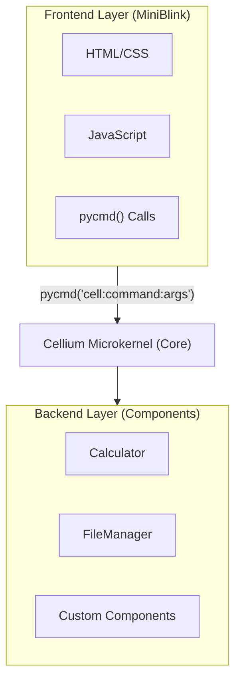
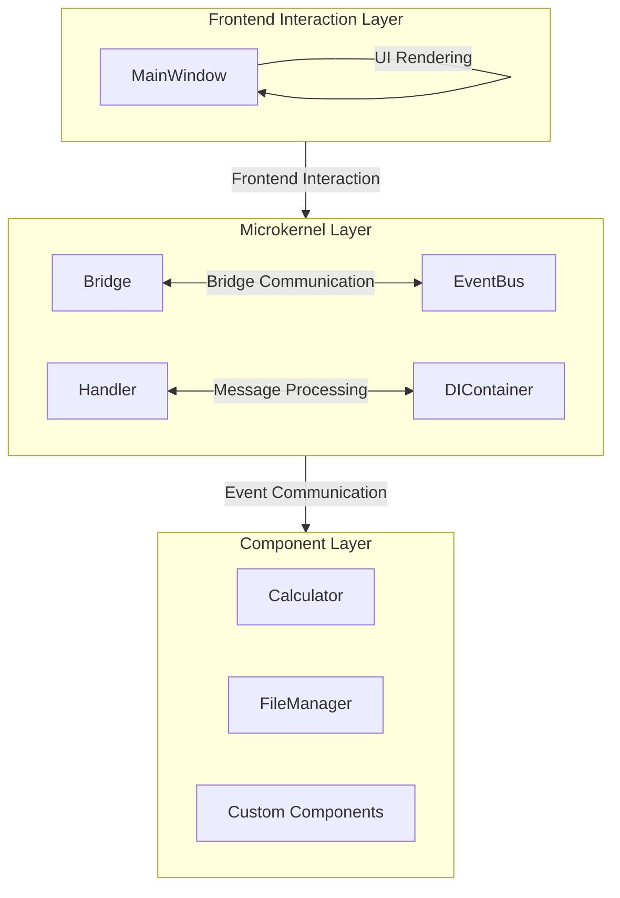
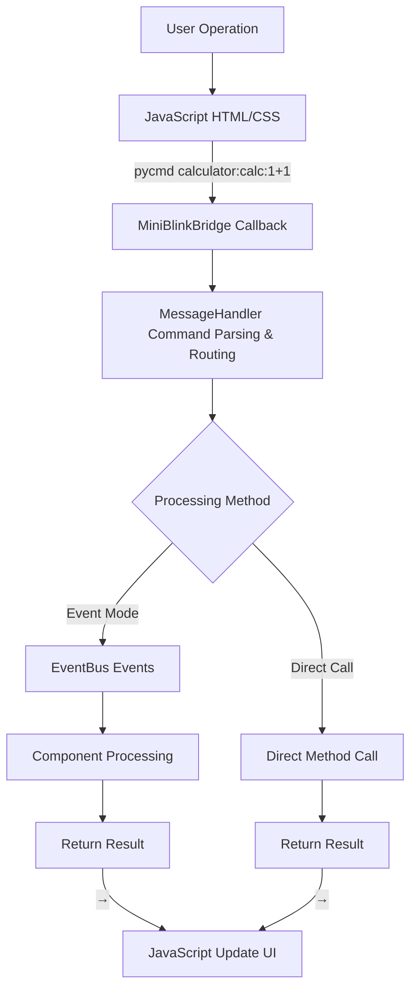
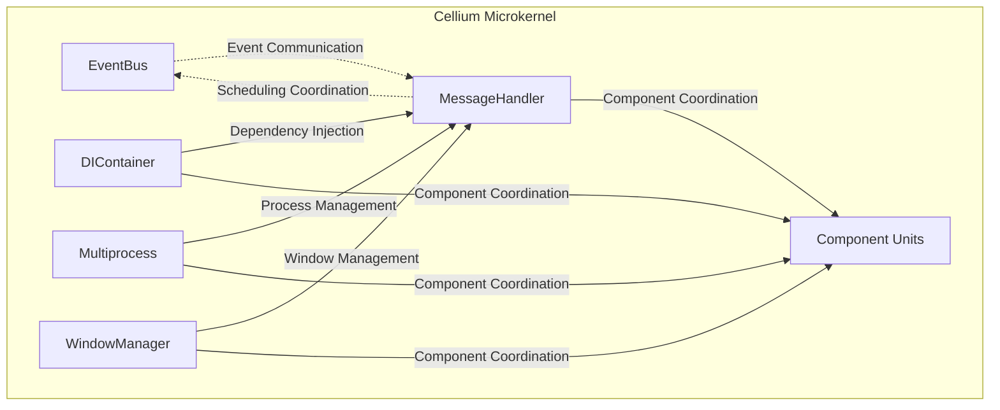

# Cellium

[中文](index.md)

## Tutorials

- [Component Tutorial](component-tutorial.en.md) | [组件开发教程（中文）](component-tutorial.md)
- [Multiprocessing Tutorial](multiprocessing-tutorial.en.md) | [多进程教程（中文）](multiprocessing.md)

---

**Python + HTML/JS Desktop Application Framework.**

A Python desktop application framework based on the "Core-Driven, Module Decoupling" philosophy.

Through a sophisticated microkernel (Core) as the scheduling hub, Cellium achieves complete separation of frontend interaction and backend logic. Developers simply encapsulate functionality into independent "cell units", while the complex cross-module communication, concurrent scheduling, and resource management are transparently handled by the Cellium core, making complex system construction as simple as assembling a puzzle.

| Feature | Description |
|----------|-------------|
| **Core-Driven** | Microkernel unified scheduling, developers focus only on business logic |
| **Module Decoupling** | Frontend and backend developed independently, communicate via protocols |
| **Simple** | Just write Python functions to define functionality, called from frontend |
| **Flexible** | Full Web frontend ecosystem, any UI framework |
| **Lightweight** | Based on MiniBlink, small size, fast startup |

**Comparison with traditional solutions:**

| Solution | Learning Cost | Development Efficiency | UI Flexibility |
|----------|--------------|----------------------|----------------|
| PyQt/Tkinter | High | Medium | Low |
| Electron | Medium | High | High |
| **Cellium** | **Low** | **High** | **High** |

**Quick Example:**
```python
# app/components/greeter.py
class Greeter(ICell):
    def _cmd_greet(self, text: str = "") -> str:
        return f"{text} Hallo Cellium"
```

```html
<!-- html/index.html -->
<button onclick="pycmd('greeter:greet:你好')">Greet</button>
```

Choose Cellium: **Build desktop applications quickly with your familiar Python and Web technologies.**

## MiniBlink Dependency

Cellium depends on [MiniBlink](https://github.com/weolar/miniblink49) as the WebView engine.

**Download:**

- **Official GitHub Releases**: https://github.com/weolar/miniblink49/releases
- **Daily Build Version**: https://gitcode.com/Resource-Bundle-Collection/68b02

**Placement:**

1. Download MiniBlink SDK from the above links (or directly download `mb132_x64.dll`)
2. Copy `mb132_x64.dll` to the `dll/` folder in the project root:

```
python-miniblink/
├── dll/
│   └── mb132_x64.dll    # <-- Place the downloaded DLL here
└── main.py
```

> **Thanks**: Thanks to the [MiniBlink](https://github.com/weolar/miniblink49) team for open-sourcing such a lightweight and high-performance browser engine, making it easy for developers to build desktop applications.

## Core Philosophy

Cellium's design follows the "Core-Driven, Module Decoupling" philosophy, simplifying complex systems into composable cell units.

### Core-Driven

The microkernel, as the system's sole core, is responsible for:

- **Command Routing** - Parse and distribute frontend commands to corresponding components
- **Event Scheduling** - Manage event communication between components
- **Lifecycle** - Coordinate component loading, initialization, and destruction
- **Resource Management** - Unified management of multiprocesses, threads, and other system resources

### Module Decoupling

Each component unit (Cell) has the following characteristics:

- **Independent Encapsulation** - Components contain complete business logic and state
- **Interface Contract** - All components implement the unified ICell interface
- **Transparent Communication** - Cross-component communication via event bus
- **Plug-and-Play** - Load via configuration, no need to modify core code

### Frontend-Backend Separation



## Architecture Design



### Design Principles

1. **Microkernel Architecture** - Core only handles scheduling and coordination, no business logic
2. **Component Units** - All functionality exists as independent components
3. **Unified Interface** - All components implement ICell interface, following the same contract
4. **Event-Driven** - Components communicate via event bus, no direct dependencies
5. **Dependency Injection** - Components don't manually import core services, auto-injected for decoupling

### Data Flow



## Directory Structure

```
cellium/
├── app/
│   ├── core/                    # Microkernel modules
│   │   ├── __init__.py          # Module exports
│   │   ├── bus/                 # Event bus
│   │   │   ├── __init__.py
│   │   │   └── event_bus.py     # Event bus implementation
│   │   ├── window/              # Window management
│   │   │   ├── __init__.py
│   │   │   └── main_window.py   # Main window
│   │   ├── bridge/              # Bridge layer
│   │   │   ├── __init__.py
│   │   │   └── miniblink_bridge.py  # MiniBlink communication bridge
│   │   ├── handler/             # Message handling
│   │   │   ├── __init__.py
│   │   │   └── message_handler.py   # Message handler (command routing)
│   │   ├── util/                # Utility modules
│   │   │   ├── __init__.py
│   │   │   ├── logger.py        # Logging management
│   │   │   ├── mp_manager.py    # Multiprocess manager
│   │   │   └── components_loader.py  # Component loader
│   │   ├── di/                  # Dependency injection
│   │   │   ├── __init__.py
│   │   │   └── container.py     # DI container
│   │   ├── interface/           # Interface definitions
│   │   │   ├── __init__.py
│   │   │   └── icell.py         # ICell component interface
│   │   ├── events.py            # Event type definitions
│   │   └── event_models.py      # Event model definitions
│   ├── components/              # Component units
│   │   ├── __init__.py
│   │   └── calculator.py        # Calculator component
│   └── __init__.py              # Application entry point
├── html/                        # HTML resources
│   └── index.html               # Main page
├── font/                        # Font files
├── dll/                         # DLL files
│   └── mb132_x64.dll            # MiniBlink engine
├── app_icon.ico                 # Application icon
├── config/                      # Configuration files
│   └── settings.yaml            # Component configuration
├── dist/                        # Build output directory
├── main.py                      # Entry file
├── build.bat                    # Build script
├── requirements.txt             # Dependencies
└── README.md                    # Documentation
```

## Core Modules

### Microkernel Core

The microkernel is Cellium's core scheduler, responsible for coordinating component work.



### EventBus

The event bus implements decoupled communication between components using the publish-subscribe pattern.

```python
from app.core import event_bus
from app.core.events import EventType

# Subscribe to events
event_bus.subscribe(EventType.CALC_RESULT, on_calc_result)

# Publish events
event_bus.publish(EventType.CALC_RESULT, result="2")
```

### ICell Interface

The unified interface specification that all components must implement.

```python
from app.core.interface.icell import ICell

class MyCell(ICell):
    @property
    def cell_name(self) -> str:
        """Component name, used for frontend call identification"""
        return "mycell"
    
    def execute(self, command: str, *args, **kwargs) -> any:
        """Execute command"""
        if command == "greet":
            return f"Hello, {args[0] if args else 'World'}!"
        return f"Unknown command: {command}"
    
    def get_commands(self) -> dict:
        """Get available command list"""
        return {
            "greet": "Greet, e.g.: mycell:greet:Alice"
        }
```

### MessageHandler

The message handler is the bridge between frontend and backend components, responsible for parsing and routing commands.

```python
class MessageHandler:
    def handle_message(self, message: str) -> str:
        """Handle frontend messages
        
        Supports two formats:
        1. ICell command: 'cell_name:command:args'
        2. Event message: JSON formatted event data
        """
        if ':' in message:
            # ICell command format
            return self._handle_cell_command(message)
        else:
            # Event message format
            return self._handle_event_message(message)
```

### MiniBlinkBridge

The bridge layer encapsulates communication between Python and the MiniBlink browser engine. Components can interact with frontend pages through the bridge.

### Dependency Injection DI

The dependency injection container provides automated service injection.

```python
from app.core.di.container import injected, AutoInjectMeta

class Calculator(metaclass=AutoInjectMeta):
    mp_manager = injected(MultiprocessManager)
    event_bus = injected(EventBus)
    
    def calculate(self, expression: str) -> str:
        return self.mp_manager.submit(_calculate_impl, expression)

---

<script src="https://cdn.jsdelivr.net/npm/mermaid/dist/mermaid.min.js"></script>
<script>
  mermaid.initialize({startOnLoad: true, theme: 'default'});
</script>
